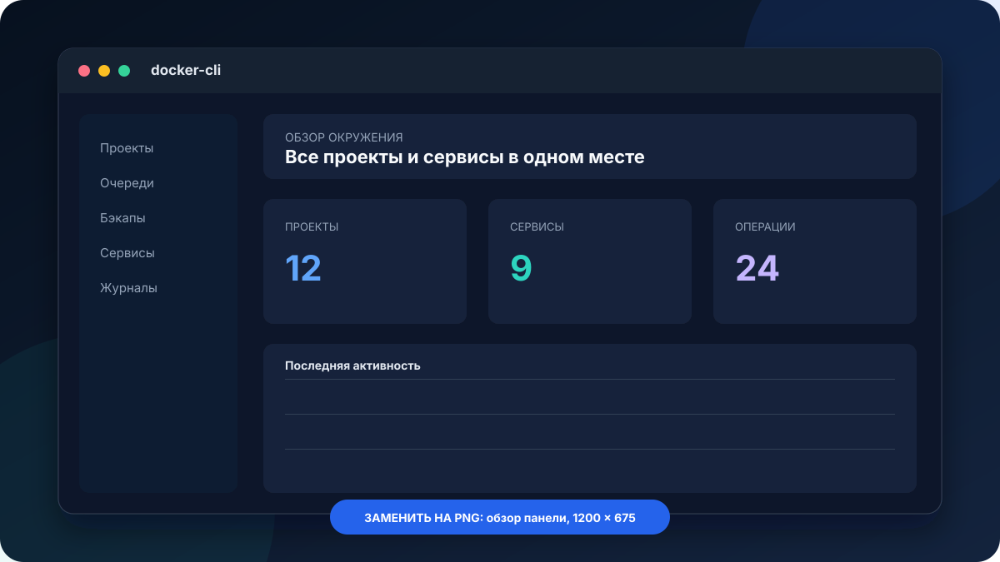
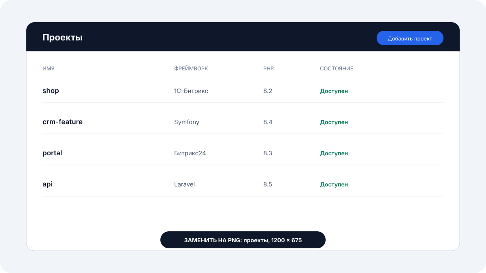
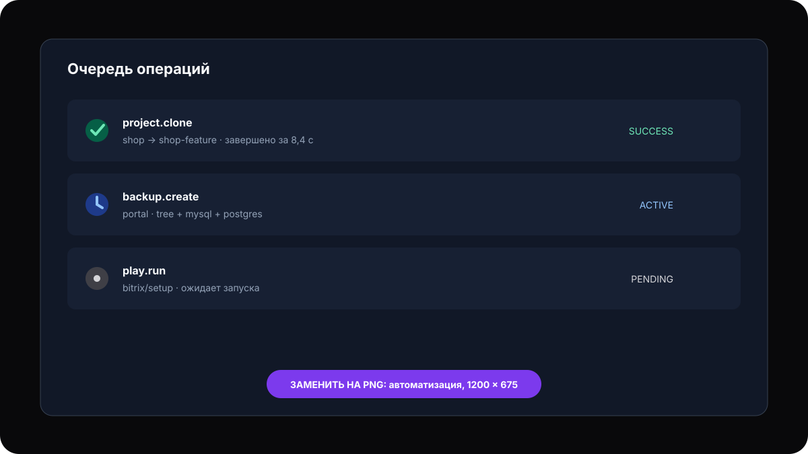

<div align="center">

# docker-cli

**Локальное Docker-окружение для PHP-проектов: один CLI, единый стек и удобная web-панель.**

Запускайте Laravel, Symfony, 1С-Битрикс и Битрикс24 с HTTPS, базами данных,
Xdebug, почтой, бэкапами и автоматизацией — без ручной сборки инфраструктуры для каждого проекта.

[](https://github.com/modern-bx/docker-cli/actions/workflows/build-phar.yml)
[](https://modern-bx.github.io/docker-cli/)
[](composer.json)
[](https://docs.docker.com/compose/)
[](LICENSE)
[](https://github.com/modern-bx/docker-cli/releases/tag/main-latest)

[Быстрый старт](#быстрый-старт) ·
[Возможности](#возможности) ·
[Документация](https://modern-bx.github.io/docker-cli/) ·
[Поддержать проект](#поддержать-проект)

</div>



## Зачем нужен docker-cli

`docker-cli` превращает набор локальных PHP-проектов в управляемую среду разработки.
Вместо отдельных compose-файлов, прокси, сертификатов и скриптов для каждой кодовой базы
вы получаете общий системный стек, короткие команды и панель для ежедневных операций.

- **Один стек для всех проектов.** Traefik, OpenResty, dnsdock, MySQL, PostgreSQL,
  Adminer, Mailpit и Dockhand запускаются и обновляются централизованно.
- **Проект готов к работе сразу.** CLI определяет Laravel, Symfony, 1С-Битрикс или
  Битрикс24, регистрирует проект, создаёт базы и публикует HTTPS-хост.
- **PHP выбирается для каждого проекта.** Одновременно используйте PHP 8.2, 8.3, 8.4
  и 8.5, не перестраивая окружение вручную.
- **CLI и web-панель дополняют друг друга.** Автоматизируйте операции командами, а
  состояние проектов, очередей, бэкапов и сервисов контролируйте в браузере.
- **Данные остаются под вашим контролем.** Конфигурация, проекты, дампы и файловые
  архивы хранятся на вашей машине или в выбранных вами каталогах.

## Возможности

### Проекты без инфраструктурной рутины

Регистрируйте существующий проект одной командой, меняйте версию PHP, отключайте web-хост
без удаления данных и создавайте полные копии проекта. Для Btrfs доступно быстрое
CoW-клонирование дерева и каталогов выделенных баз данных.

```bash
docker-cli project:up shop
docker-cli project:update --language-version=8.4
docker-cli project:clone --from=shop --to=shop-feature --mirror
```



### Бэкапы, которые видны целиком

Создавайте и восстанавливайте файловые архивы, MySQL- и PostgreSQL-дампы независимо
или как одну составную копию. Поддерживаются именованные стратегии включения и исключения,
несколько алгоритмов сжатия, деление на тома и отдельные расположения хранилищ.

```bash
docker-cli tree:dump --project=shop --name=release-42 --compress=zstd
docker-cli mysql:dump --project=shop --name=release-42 --threads=8
docker-cli postgres:dump --project=shop --name=release-42 --jobs=8
```

### Автоматизация поверх обычных файлов

Описывайте переиспользуемые задачи в YAML, объединяйте их в файловые очереди и запускайте
обработчик как systemd-сервис. Before- и after-хуки позволяют встроить собственные
скрипты в жизненный цикл проектных команд, а журналы сохраняют stdout, stderr и коды возврата.



### Всё необходимое для локальной разработки

| Возможность | Что получает разработчик |
| --- | --- |
| HTTPS и DNS | Проектные домены, wildcard-сертификаты через Cloudflare DNS challenge и автоматическую маршрутизацию |
| PHP-FPM | Изолированный runtime PHP 8.2–8.5 с корректным UID/GID и shell-доступом |
| Xdebug | Отдельный IDE-порт для каждого проекта и готовый trigger для web и CLI |
| Базы данных | Общие или выделенные MySQL/PostgreSQL, Adminer, параллельные дампы и восстановление |
| Почта | Локальный SMTP через Mailpit с web-интерфейсом и постоянным хранилищем |
| Браузерные сценарии | Playwright-задачи в Chromium, Firefox или WebKit, включая визуальный режим |
| Наблюдаемость | Панель состояния, журналы операций, уведомления и Dockhand для контейнеров |
| Расширение | Пользовательские YAML-задачи, shell-хуки и собственные образы сервисов |

## Быстрый старт

### Требования

- Linux с Docker Engine и Docker Compose;
- PHP 8.2 или новее для запуска PHAR;
- домен в Cloudflare для автоматического выпуска локальных HTTPS-сертификатов.

### Установка PHAR

```bash
mkdir -p ~/.local/bin
curl -L https://github.com/modern-bx/docker-cli/releases/download/main-latest/docker-cli.phar \
  -o ~/.local/bin/docker-cli
chmod +x ~/.local/bin/docker-cli
docker-cli --version
```

Убедитесь, что `~/.local/bin` входит в `PATH`. Затем создайте конфигурацию, заполните
`BASE_HOST` и параметры Cloudflare в `~/.config/docker-cli/compose/system/.env`,
сгенерируйте секреты и запустите окружение:

```bash
docker-cli config:init
docker-cli config:seed
docker-cli system:start
```

Теперь перейдите в каталог PHP-проекта и зарегистрируйте его:

```bash
cd ~/projects/shop
docker-cli project:up shop
```

Полная подготовка домена, DNS и браузера описана в
[руководстве по быстрому старту](https://modern-bx.github.io/docker-cli/guide/getting-started).

## Документация

| Раздел | Содержание |
| --- | --- |
| [Быстрый старт](https://modern-bx.github.io/docker-cli/guide/getting-started) | Инициализация, запуск окружения и регистрация первого проекта |
| [Базовые сервисы](https://modern-bx.github.io/docker-cli/guide/services) | Состав стека, сетевые адреса, хранилища и доступ к сервисам |
| [Справочник команд](https://modern-bx.github.io/docker-cli/reference/commands) | Аргументы, опции и примеры всех CLI-команд |
| [Бэкапы](https://modern-bx.github.io/docker-cli/guide/backups) | Файловые копии, MySQL, PostgreSQL и внешние хранилища |
| [Задачи и очереди](https://modern-bx.github.io/docker-cli/guide/tasks) | YAML-задачи, параметры, очередь выполнения и systemd |
| [Xdebug](https://modern-bx.github.io/docker-cli/guide/xdebug) | Настройка PhpStorm и разделение IDE-портов проектов |
| [PHP-SPX](https://modern-bx.github.io/docker-cli/guide/spx) | Профилирование web-запросов и консольных скриптов |
| [Playwright](https://modern-bx.github.io/docker-cli/guide/playwright) | Браузерные сценарии, данные, логирование и визуальный режим |

## Разработка

Для локальной разработки нужны PHP 8.2+, Composer и Node.js. Зависимости Composer
разрешаются для платформы PHP 8.2, чтобы lock-файл оставался совместимым с минимальной
поддерживаемой версией.

```bash
composer install
composer quality
npm --prefix resources/panel ci
npm --prefix resources/panel run check
npm --prefix resources/panel run build
npm --prefix site ci
npm --prefix site run build
```

Сборка самостоятельного PHAR вместе с production-версией панели:

```bash
composer build
build/docker-cli.phar --version
```

Перед изменениями прочитайте [AGENTS.md](AGENTS.md): в нём описаны архитектурные
ограничения, правила оформления и обязательные проверки проекта.

## Поддержать проект

`docker-cli` развивается открыто и остаётся бесплатным. Если он экономит вам время
на настройке окружений и ежедневных операциях, поддержите дальнейшую разработку.

<div align="center">

[](https://boosty.to/modern-bx)

Поддержка помогает уделять больше времени новым возможностям, документации и стабильным релизам.

</div>

## Лицензия

Проект распространяется по лицензии [Apache License 2.0](LICENSE).
