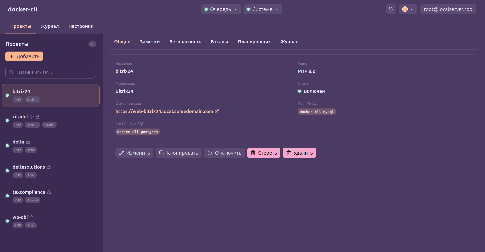

<div align="center">

# docker-cli

**Автоматизированное Docker-окружение для PHP-проектов (и не только): единый CLI, настроенный из коробки стек
и удобная web-панель.**

Подготовьте новую рабочую станцию, ноутбук, сервер к работе в один клик. Ручная настройка пакетов, их конфигов
и проектов больше не нужна, за вас все сделают.

[](https://github.com/modern-bx/docker-cli/actions/workflows/build-phar.yml)
[](https://modern-bx.github.io/docker-cli/)
[](composer.json)
[](https://docs.docker.com/compose/)
[](LICENSE)
[](https://github.com/modern-bx/docker-cli/releases/tag/main-latest)

[Быстрый старт](#быстрый-старт) ·
[Документация](https://modern-bx.github.io/docker-cli/) ·
[Поддержать проект](#поддержать-проект)

</div>



## Зачем нужен docker-cli

`docker-cli` нужен того, чтобы экономить время занятого разработчика или DevOps-а за счет автоматизации
как начальной развертки контура для разработки, так и типовых операций для работы с веб-проектами.
Вместо отдельных compose-файлов, прокси, сертификатов и скриптов для каждого репозитория
вы получаете единый связный стек, короткие команды через удобный CLI и веб-панель для тех, кому не хочется
что-то печатать.

- Установка через однострочник. Все зависимости, необходимые для работы, приложение поставит само
- Единый Docker-контур - все сервисы видят друг друга без необходимости вручную прописывать им сети
- Автоматическая регистрация DNS-имен в systemd - /etc/hosts править больше не нужно
- Автоматические локальные HTTPS-хосты
- Автоматическая регистрация проектов с определением фреймворка
- Переключение версия PHP-FPM, встроенные XDebug и PHP-SPX
- Поддержка MySQL и PostgreSQL и возможность выноса данных отдельных высоконагруженных проектов в отдельные инстансы
- Бэкапы проектов - полные и частичные, однотомные и многотомные, с оптимизацией по скорости создания и восстановления
  и возможностью настройки стратегий для файлов и БД
- Быстрое копирование проектов через CoW. Если вам нужно протестировать гипотезу и вы не хотите сломать
  большой проект, сделайте его клон за 10 секунд
- Mailpit для работы с почтой, Adminer для операций с БД
- Планировщик для запуска Cron-задач в каждом из проектов
- Поддержка командных хуков для расширенной автоматизации
- Поддержка Playwright - разворачивайте ПО, требующее работы мастеров (например, тот же Битрикс),
  в полностью автоматическом режиме
- Подробный журнал событий, в котором всегда видно, чем сейчас занят стек
- Web-панель, из которой крайне удобно управлять всем перечисленным
- И многое другое. Проект очень быстро развивается

## Быстрый старт

### Требования

- Linux с Docker Engine и Docker Compose;
- PHP 8.2 или новее для запуска PHAR;
- домен в Cloudflare для автоматического выпуска локальных HTTPS-сертификатов.

### Установка PHAR

```bash
mkdir -p ~/.local/bin
curl -L https://github.com/modern-bx/docker-cli/releases/download/main-latest/docker-cli.phar \
  -o ~/.local/bin/docker-cli
chmod +x ~/.local/bin/docker-cli
docker-cli --version
```

Убедитесь, что `~/.local/bin` входит в `PATH`. Затем создайте конфигурацию, заполните
`BASE_HOST` и параметры Cloudflare в `~/.config/docker-cli/compose/system/.env`,
сгенерируйте секреты и запустите окружение:

```bash
docker-cli config:init
docker-cli config:seed
docker-cli system:start
```

Теперь перейдите в каталог PHP-проекта и зарегистрируйте его:

```bash
cd ~/projects/shop
docker-cli project:up shop
```

После этого проект будет доступен в браузере на поддомене указанного вами домена.

Сервис, работающий непосредственно на хост-машине, можно зарегистрировать как внешний. HTTP-трафик будет
проксироваться на `EXTERNAL_SERVICE_PORT` из системного `.env` (по умолчанию `8080`) или на порт проекта:

```bash
docker-cli project:up api --external --external-port=3000
docker-cli project:update --external --external-port=3001
```

Полная подготовка домена, DNS и браузера описана в
[руководстве по быстрому старту](https://modern-bx.github.io/docker-cli/guide/getting-started).

## Документация

| Раздел | Содержание |
| --- | --- |
| [Быстрый старт](https://modern-bx.github.io/docker-cli/guide/getting-started) | Инициализация, запуск окружения и регистрация первого проекта |
| [Базовые сервисы](https://modern-bx.github.io/docker-cli/guide/services) | Состав стека, сетевые адреса, хранилища и доступ к сервисам |
| [Справочник команд](https://modern-bx.github.io/docker-cli/reference/commands) | Аргументы, опции и примеры всех CLI-команд |
| [Бэкапы](https://modern-bx.github.io/docker-cli/guide/backups) | Файловые копии, MySQL, PostgreSQL и внешние хранилища |
| [Задачи и очереди](https://modern-bx.github.io/docker-cli/guide/tasks) | YAML-задачи, параметры, очередь выполнения и systemd |
| [Xdebug](https://modern-bx.github.io/docker-cli/guide/xdebug) | Настройка PhpStorm и разделение IDE-портов проектов |
| [PHP-SPX](https://modern-bx.github.io/docker-cli/guide/spx) | Профилирование web-запросов и консольных скриптов |
| [Playwright](https://modern-bx.github.io/docker-cli/guide/playwright) | Браузерные сценарии, данные, логирование и визуальный режим |

## Разработка

Для локальной разработки нужны PHP 8.2+, Composer и Node.js. Зависимости Composer
разрешаются для платформы PHP 8.2, чтобы lock-файл оставался совместимым с минимальной
поддерживаемой версией.

```bash
composer install
composer quality
npm --prefix resources/panel ci
npm --prefix resources/panel run check
npm --prefix resources/panel run build
npm --prefix site ci
npm --prefix site run build
```

Сборка самостоятельного PHAR вместе с production-версией панели:

```bash
composer build
build/docker-cli.phar --version
```

Перед изменениями прочитайте [AGENTS.md](AGENTS.md): в нём описаны архитектурные
ограничения, правила оформления и обязательные проверки проекта.

## Поддержать проект

`docker-cli` развивается бесплатно и открыто.
Если он экономит вам время, поддержите дальнейшую разработку.

<div align="center">

[](https://boosty.to/modern-bx)
[](https://pay.cloudtips.ru/p/cdc00b51)

Поддержка помогает уделять больше времени новым возможностям, документации и стабильным релизам.

</div>

## Лицензия

Проект распространяется по лицензии [Apache License 2.0](LICENSE).
